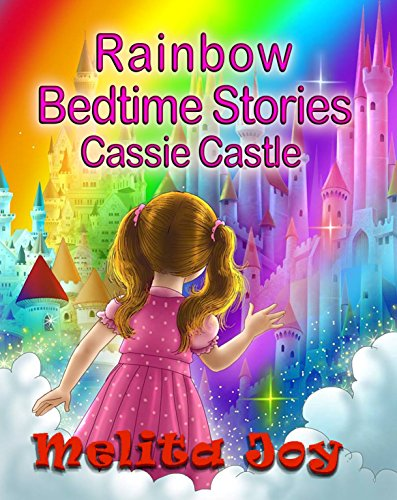

<!-- Banner -->
  <section id="banner">
    <h2>Melita Joy's life has  
      always been eventful.   
    <!-- Having ridden wonderful highs  
    and suffered tremendous setbacks,   -->
    her outlook has always been:  
    I'll write about this one day! 
    </h2>
    <ul class="actions special">
      <li><a href="/about" class="button large">Full Story</a></li>
    </ul>
  </section>

<!-- Two -->
  <section class="main style2">
    <header class="major">
      <h2>Best sellers</h2>
      
More books available on <a href="https://www.amazon.com/Melita-Joy/e/B00Q82KJR8/ref=dp_byline_cont_ebooks_1">Amazon</a>

    </header>
    <section class="left">
      
      

        <h3><a href="https://www.amazon.com/gp/product/B01IF5AAN8/ref=dbs_a_def_rwt_bibl_vppi_i2">Gisella</a></h3>
        
Friendship, love and betrayal.

        
Gisella Roth has seen more than she should have.

        
As a driven young adult striving to make her own way, both finding out how the world works and
          how to find her place in it, Gisella must first grapple with her twisted past, a looming
          darkness that is always pressing at the edges of her thoughts and shaping her words and actions—whether
          she realizes it or not.

      

    </section>

    <section class="right">
      
      

        <h3><a href="https://www.amazon.com/gp/product/B011L2ZSQQ/ref=dbs_a_def_rwt_bibl_vppi_i0">His Discarded Bride</a></h3>
        
Leilani Davide can’t believe this is happening to her. Her pulse clambering desperately, she waits for the plane to take off.

        
Suddenly forced into a world of fantastic wealth, a dangerously successful business empire,
          and the bizarre circumstances of imminent arranged marriage, Leilani must ask herself if she will ever uncover
          the tiny shards of her past through the pending disaster…

          
And if she can succeed, will it be worth the cost? 

      

    </section>

    <section class="left">
      
      

        <h3><a href="https://www.amazon.com/gp/product/B01NAR6E61/ref=dbs_a_def_rwt_bibl_vppi_i9">Cassie Castle</a></h3>
        
Rosie is a flying rainbow who will take you on a fantasy ride high up into the sky. 

        
In Cassie Castle, you will be taken to a fantasy castle in the sky. The castle is filled with many delights
          such as a giant slippery dip, magic mirrors, train ride, doll house, jelly pool and a maze.

          
Rosie will ensure that you have wonderful things to think about so that you can hopefully have pleasant dreams.

      

    </section>

    <footer class="major">
      
Books now available online 
      at Dymocks Australia

      <ul class="actions special">
        <li><a href="https://www.dymocks.com.au/search-results/?str=Melita%20Joy&IsAdv=false" class="button large primary">Buy Now</a></li>
      </ul>
    </footer>
  </section>
